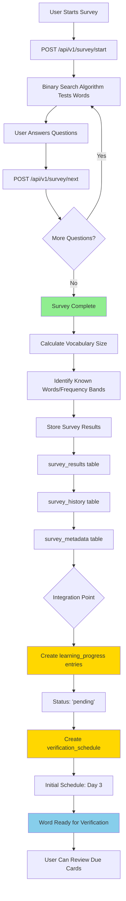
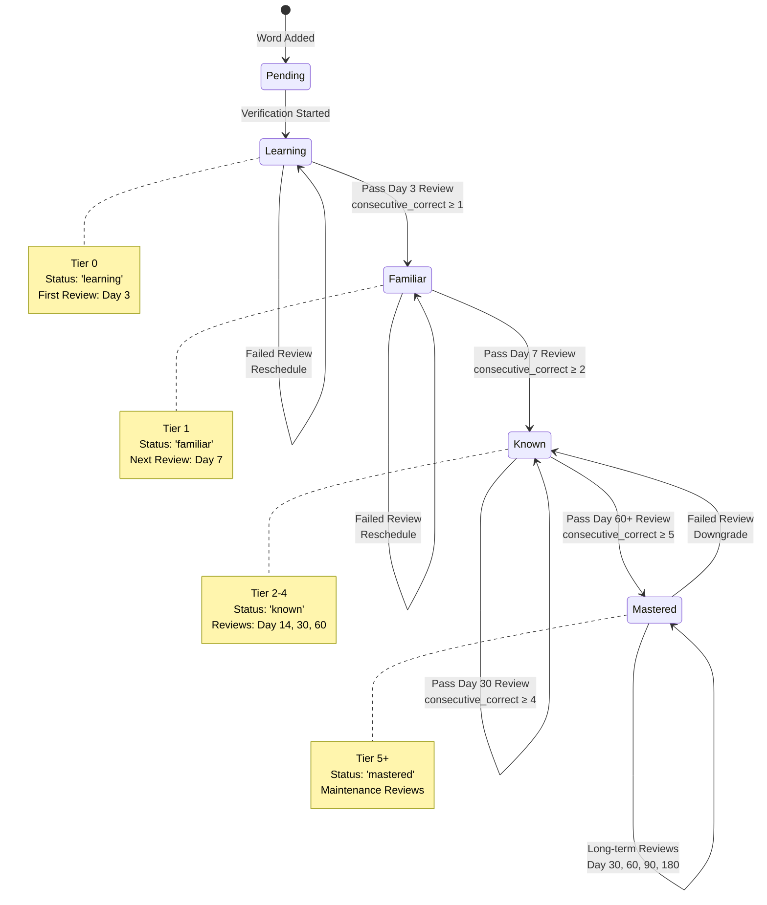
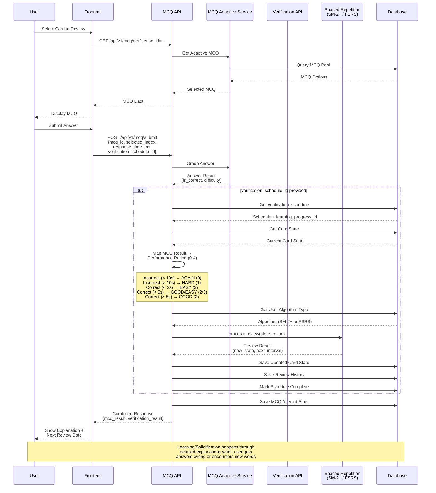

# Integration Flow Diagrams
## Visual Documentation of System Integration Flows

**Status:** ✅ Complete  
**Last Updated:** January 2025  
**Purpose:** Visual documentation to help understand system architecture and integration points

---

## Overview

This document contains Mermaid diagrams for the four key integration flows in the LexiCraft verification system:

1. **Survey → Verification Integration Flow** - How survey completion integrates with verification
2. **Word Selection → Verification Start → MCQ Flow** - Complete user journey from discovery to quiz
3. **Mastery Progression Flow** - How words progress through mastery levels
4. **MCQ ↔ Verification Integration Flow** - Bidirectional integration between MCQ and verification systems

---

## 1. Survey → Verification Integration Flow

**Purpose:** Shows how survey completion identifies words and prepares them for verification.

**Key Points:**
- Survey uses binary search algorithm to efficiently identify known words
- Survey results stored in `survey_results`, `survey_history`, `survey_metadata` tables
- **Current Gap:** No automatic conversion to `learning_progress` entries (needs implementation)
- Words can be manually started via `POST /api/v1/words/start-verification`
- Future: Automatic conversion endpoint to create `learning_progress` entries from survey results

**APIs:**
- `POST /api/v1/survey/start` - Start new survey session
- `POST /api/v1/survey/next` - Submit answer and get next question
- `POST /api/v1/words/start-verification` - Manually start verification for word

---

## 2. Word Selection → Verification Start → MCQ Flow

**Purpose:** Complete user journey from word discovery through verification quiz completion.

```mermaid
flowchart TD
    A[User Discovers Word] --> B{Discovery Method}
    B -->|Survey| C[Survey Identifies Word]
    B -->|Explorer Mode| D[User Looks Up Word]
    B -->|Recommendation| E[System Suggests Word]
    
    C --> F[Word in learning_progress<br/>status: 'pending']
    D --> G[Dictionary Feature<br/>View Definition/Examples]
    E --> H[Word Suggestion]
    
    G --> I[User Starts Verification]
    H --> I
    F --> I
    
    I --> J[POST /api/v1/words/start-verification]
    J --> K{learning_progress exists?}
    K -->|No| L[Create learning_progress<br/>status: 'pending']
    K -->|Yes| M[Use Existing Entry]
    
    L --> N[Get User Algorithm<br/>SM-2+ or FSRS]
    M --> N
    
    N --> O[Create verification_schedule]
    O --> P[Initialize Card State]
    P --> Q[Schedule First Review<br/>Typically Day 3]
    
    Q --> R[Word Ready for Verification]
    R --> S[User Reviews Due Cards]
    S --> T[GET /api/v1/verification/due]
    T --> U[Select Card to Review]
    
    U --> V[GET /api/v1/mcq/get]
    V --> W[MCQ Adaptive Service]
    W --> X[Select MCQ by Difficulty]
    X --> Y[Display MCQ to User]
    
    Y --> Z[User Answers MCQ]
    Z --> AA[POST /api/v1/mcq/submit]
    AA --> AB[Record MCQ Attempt]
    AB --> AC{verification_schedule_id<br/>provided?}
    
    AC -->|Yes| AD[Get Card State]
    AC -->|No| AE[Return MCQ Feedback Only]
    
    AD --> AF[Map MCQ Result to<br/>Performance Rating 0-4]
    AF --> AG[Process Review via Algorithm]
    AG --> AH[Update Card State]
    AH --> AI[Save Review History]
    AI --> AJ[Update verification_schedule]
    AJ --> AK[Return Combined Result<br/>MCQ + Verification]
    
    AK --> AL[Show Detailed Explanation]
    AL --> AM[Display Next Review Date]
    AM --> AN[Update Mastery Level]
    
    style I fill:#FFD700
    style J fill:#FFD700
    style O fill:#90EE90
    style AA fill:#87CEEB
    style AG fill:#90EE90
    style AL fill:#FFB6C1
```

**Key Points:**
- **Multiple Entry Points:** Survey, Explorer Mode (dictionary lookup), System Recommendations
- **Dictionary Feature:** Informational only - not where learning/solidification happens
- **Verification Start:** Creates both `learning_progress` (status: 'pending') and `verification_schedule`
- **MCQ Integration:** When `verification_schedule_id` is provided, MCQ submission automatically updates spaced repetition
- **Learning/Solidification:** Happens through detailed MCQ explanations, especially when users get answers wrong or encounter new words

**APIs:**
- `POST /api/v1/words/start-verification` - Start verification for a word
- `GET /api/v1/verification/due` - Get cards due for review
- `GET /api/v1/mcq/get` - Get adaptive MCQ for verification
- `POST /api/v1/mcq/submit` - Submit MCQ answer (with optional verification integration)

---

## 3. Mastery Progression Flow

**Purpose:** Shows how words progress through mastery levels based on review performance.

**Mastery Level Thresholds:**

| Mastery Level | Tier | Status | Consecutive Correct Required | Review Interval | Next Level Threshold |
|--------------|------|--------|----------------------------|-----------------|---------------------|
| Learning | 0 | `learning` | 0 | Day 3 | Familiar (≥1) |
| Familiar | 1 | `familiar` | ≥1 | Day 7 | Known (≥2) |
| Known | 2-4 | `known` | ≥2-4 | Day 14, 30, 60 | Mastered (≥5) |
| Mastered | 5+ | `mastered` | ≥5 | Day 30, 60, 90, 180 | Maintenance |

**Progression Rules:**

1. **Upgrade Conditions:**
   - Must pass review (correct answer)
   - Must meet consecutive_correct threshold for next level
   - Algorithm calculates new interval based on performance

2. **Downgrade Conditions:**
   - Failing a review resets consecutive_correct counter
   - May downgrade mastery level if consecutive failures
   - Algorithm reschedules with shorter interval

3. **Algorithm Support:**
   - Both SM-2+ and FSRS calculate mastery based on consecutive_correct and review intervals
   - FSRS uses additional factors: stability, difficulty, retention probability

4. **Leech Detection:**
   - Words that fail repeatedly may be marked as "leech"
   - Leeches require special handling or may be paused

**Status Mapping:**
- `pending` → Verification not yet started
- `learning` → Tier 0, first verification attempts
- `familiar` → Tier 1, passed first review
- `known` → Tier 2-4, solid knowledge
- `mastered` → Tier 5+, long-term retention

---

## 4. MCQ ↔ Verification Integration Flow

**Purpose:** Shows the bidirectional integration between MCQ system and Verification/Spaced Repetition system.

**Integration Points:**

### 1. MCQ Generation
- **API:** `GET /api/v1/mcq/get?sense_id=...`
- **Process:** MCQ Adaptive Service selects MCQ based on user's current ability
- **Output:** MCQ with appropriate difficulty level

### 2. MCQ Submission with Verification
- **API:** `POST /api/v1/mcq/submit`
- **Optional Parameter:** `verification_schedule_id`
- **When Provided:** Automatically processes spaced repetition review
- **Output:** Combined result with both MCQ feedback and verification data

### 3. Performance Rating Mapping

The system maps MCQ results to spaced repetition performance ratings:

| MCQ Result | Response Time | MCQ Difficulty | Performance Rating | Meaning |
|------------|---------------|----------------|-------------------|---------|
| Incorrect | < 10s | Any | 0 (AGAIN) | Quick wrong - didn't know |
| Incorrect | > 10s | Any | 1 (HARD) | Struggled but wrong |
| Correct | < 2s | Any | 3 (EASY) | Instant recall |
| Correct | < 5s | Low | 3 (EASY) | Quick recall, easy question |
| Correct | < 5s | High | 2 (GOOD) | Quick recall, hard question |
| Correct | > 5s | Any | 2 (GOOD) | Some effort required |

### 4. State Synchronization

- **MCQ Stats:** Stored in `mcq_attempts` and `mcq_stats` tables
- **Verification State:** Stored in `verification_schedule` table
- **Review History:** Stored in `verification_review_history` table
- **Single API Call:** Updates all systems simultaneously

### 5. Alternative Flow: Direct Review

Users can also bypass MCQ system and use direct review:

- **API:** `POST /api/v1/verification/review`
- **Use Case:** Non-MCQ verification methods
- **Process:** Direct spaced repetition update without MCQ integration

**Benefits of Integration:**
1. **Seamless Experience:** Single API call updates both systems
2. **Consistent State:** MCQ stats and verification schedule stay in sync
3. **Algorithm Support:** Works with both SM-2+ and FSRS algorithms
4. **Rich Feedback:** Users get both MCQ explanations and verification progress

---

## Related Documentation

- [Verification Flow & Guiding System](./VERIFICATION_FLOW_GUIDING.md) - Complete flow documentation
- [Word Verification System](./WORD_VERIFICATION_SYSTEM.md) - Spaced repetition details
- [MCQ System](./MCQ_SYSTEM.md) - MCQ system details
- [Gap Analysis](./GAP_ANALYSIS.md) - Current implementation gaps

---

**Document Version:** 1.0  
**Last Updated:** January 2025

