# Verification Flow & Guiding System Documentation
## How Users Progress Through Vocabulary Verification

**Status:** 📋 Documentation  
**Component:** Core Verification System - Part 3

---

## Overview

The Verification Flow & Guiding System orchestrates the user's vocabulary verification journey. **The system verifies and solidifies vocabulary knowledge that users have typically encountered elsewhere (school, books, media).** We are not a school or curriculum that presents words in complete contexts. Users learn from outside sources, and we verify/solidify that knowledge through gamified quizzes. When users encounter words they don't know (or get wrong), detailed explanations facilitate learning/solidification, reinforced by FSRS spaced repetition presenting the same word senses repeatedly. Users can also use the system as a learning tool, but we don't teach in a structured curriculum format. Users can look up words anytime (dictionary feature), but learning/solidification occurs through verification quizzes.

---

## System Role & Positioning

**We are NOT:**
- A school that teaches vocabulary in structured lessons
- A curriculum that presents words in complete contexts (articles, stories)
- A teacher that explains everything from scratch

**We ARE:**
- A verification and solidification platform
- A tool that verifies what users have encountered elsewhere (school, books, media)
- A facilitator that can help users learn through MCQ explanations
- A learning tool users can actively use (but not a structured curriculum)

**Primary Model:**
Users encounter words elsewhere → We verify/solidify that knowledge

**Secondary Model:**
Users can use us as a learning tool → We facilitate learning through explanations (not structured teaching)

---

## Verification Journey Stages

### Stage 1: Discovery (Survey)

**Purpose:** Identify words the user has encountered (may or may not fully know)

**Flow:**
```
User takes vocabulary survey
  ↓
Binary search algorithm tests words
  ↓
System identifies known words
  ↓
Words added to learning_progress (status: 'pending')
  ↓
User can deposit/verify these words
```

**API:** `POST /api/v1/survey/start`, `POST /api/v1/survey/next`

---

### Stage 2: Word Lookup & Verification Start

**Purpose:** Users can look up words (dictionary feature) and start verification

**Flow:**
```
User looks up word (dictionary feature - not learning)
  OR
System suggests word for verification (Explorer Mode)
  ↓
User views word details (optional):
  - Definition (EN + ZH)
  - Examples
  - Connections (related words)
  ↓
User starts verification (via API)
  ↓
Word added to learning_progress (status: 'pending')
  ↓
Verification schedule created
  ↓
Word ready for verification quiz
```

**API:** `POST /api/v1/words/start-verification`, `GET /api/v1/dashboard`

**Note:** 
- Word lookup is a dictionary feature - not where learning/solidification happens
- Learning/solidification happens through MCQ explanations during verification
- All words are accessible (Explorer Mode)

---

### Stage 3: Verification (Spaced Repetition) - **THIS IS WHERE LEARNING/SOLIDIFICATION HAPPENS**

**Purpose:** Verify and solidify word knowledge through gamified MCQ quizzes. **Learning/solidification happens through detailed explanations, especially when users get answers wrong or encounter words they haven't fully verified yet.**

**Flow:**
```
Initial verification scheduled (algorithm determines interval, typically Day 3)
  ↓
User reviews due cards
  ↓
System shows MCQ (adaptive difficulty)
  ↓
User answers MCQ
  ↓
**System shows detailed explanation:**
  - Why answer is correct/incorrect
  - Example sentences
  - Related words
  - Connections
  - **This is where learning/solidification happens!**
  ↓
System processes:
  - If pass: Schedule next review (Day 7, 14, 30...)
  - If fail: Reschedule (algorithm determines interval)
  - Update mastery level
  - Update learning_progress status
  ↓
Repeat until mastered
```

**API:** `GET /api/v1/verification/due`, `POST /api/v1/mcq/submit`

**Key Insight:** The verification quiz IS the learning/solidification interface. Users learn/solidify through the MCQ questions and explanations, not through a separate "study" step. We verify what users have encountered elsewhere and facilitate learning when they encounter unknown words or get answers wrong.

---

### Stage 4: Mastery (Long-term Retention)

**Purpose:** Maintain long-term retention

**Flow:**
```
Word reaches "mastered" status
  ↓
Long-term reviews scheduled:
  - Day 30
  - Day 60
  - Day 90
  - Day 180
  ↓
Periodic reviews maintain retention
  ↓
Word remains in active vocabulary
```

---

## Guiding Mechanisms

### 1. Due Cards System

**Purpose:** Show users what to review

**Implementation:**
- Queries `verification_schedule` for cards due today
- Prioritizes overdue cards
- Sorts by retention probability (lowest first)

**API:** `GET /api/v1/verification/due?limit=20`

**Response:**
```json
[
  {
    "verification_schedule_id": 123,
    "word": "break",
    "scheduled_date": "2025-01-10",
    "days_overdue": 2,
    "mastery_level": "learning",
    "retention_predicted": 0.45  // Low = needs review
  }
]
```

---

### 2. Progress Indicators

**Purpose:** Show users their learning progress

**Metrics:**
- **Vocabulary Size**: Total words verified
- **Mastery Distribution**: Learning/Familiar/Known/Mastered counts
- **Learning Velocity**: Words verified per week
- **Retention Rate**: Percentage of correct reviews
- **Streak**: Consecutive days of verification

**API:** `GET /api/v1/dashboard`

**Response:**
```json
{
  "vocabulary": {
    "vocabulary_size": 1247,
    "growth_rate_per_week": 25.3
  },
  "performance": {
    "retention_rate": 0.784,
    "cards_learning": 45,
    "cards_familiar": 120,
    "cards_known": 350,
    "cards_mastered": 732
  },
  "activity": {
    "words_verified_this_week": 28,
    "activity_streak_days": 12
  }
}
```

---

### 3. Adaptive Recommendations

**Purpose:** Suggest what to learn/review next

**Recommendations:**

**1. Review Recommendations**
- Cards due for review (prioritized)
- Cards at risk (low retention probability)
- Overdue cards

**2. Verification Recommendations**
- Words suggested for verification (Explorer Mode)
- Words related to recently verified words
- Words at appropriate difficulty level

**3. Mastery Recommendations**
- Words close to next mastery level
- Words that need more practice
- Words at risk of becoming leeches

---

## Verification Progression

### Tier System

**Tier 0**: Verification started, not yet verified
- Status: `pending` or `learning`
- Verification scheduled

**Tier 1**: Passed Day 3 review
- Status: `familiar`
- Next review: Day 7

**Tier 2**: Passed Day 7 review
- Status: `known` (beginning)
- Next review: Day 14

**Tier 3**: Passed Day 14 review
- Status: `known` (solid)
- Next review: Day 30

**Tier 4**: Passed Day 30 review
- Status: `known` (advanced)
- Next review: Day 60

**Tier 5+**: Passed Day 60+ review
- Status: `mastered`
- Long-term maintenance reviews

### Mastery Levels

```
learning → familiar → known → mastered
   ↓          ↓         ↓         ↓
  Tier 0    Tier 1   Tier 2-4  Tier 5+
```

---

## Current Implementation Status

### ✅ Working
- Due cards system
- Progress tracking (vocabulary size, mastery counts)
- Learning velocity calculation
- Retention rate calculation
- Streak tracking

### ⚠️ Needs Documentation/Clarification
- Word discovery flow (survey → verification)
- Recommendation algorithm details
- Verification path guidance
- Review prioritization logic

### ❓ Unknown/To Investigate
- How users discover new words (beyond survey)
- How the system suggests next words to verify
- How mastery progression thresholds work
- How review sessions are structured
- How users are guided through the verification journey

---

## API Endpoints

### Dashboard
`GET /api/v1/dashboard`
- Overall progress summary
- Vocabulary statistics
- Activity metrics
- Performance metrics

### Analytics
`GET /api/v1/analytics/*`
- Detailed verification analytics
- Trends and predictions
- Performance insights

### Verification
`GET /api/v1/verification/due`
- Cards due for review
- Prioritized list
- Review recommendations

---

## Integration Flow Diagrams

> **📊 Full Diagrams Document:** See [INTEGRATION_FLOW_DIAGRAMS.md](./INTEGRATION_FLOW_DIAGRAMS.md) for detailed diagrams with explanations.

### 1. Survey → Verification Integration Flow

This diagram shows how survey completion integrates with the verification system:


**Key Points:**
- Survey identifies words user has encountered (may not fully know)
- Survey results stored in `survey_results`, `survey_history`, `survey_metadata`
- **Integration Gap:** Currently no automatic conversion to `learning_progress` entries
- Words need to be manually started via `POST /api/v1/words/start-verification` or automatic conversion endpoint (to be implemented)

---

### 2. Word Selection → Verification Start → MCQ Flow

This diagram shows the complete flow from word selection to MCQ completion:


**Key Points:**
- Multiple entry points: Survey, Explorer Mode, Recommendations
- Dictionary lookup is informational only (not where learning happens)
- Verification start creates both `learning_progress` and `verification_schedule`
- MCQ submission automatically updates spaced repetition when `verification_schedule_id` is provided
- **Learning/Solidification happens through MCQ explanations**, especially when users get answers wrong

---

### 3. Mastery Progression Flow

This diagram shows how words progress through mastery levels:

```mermaid
stateDiagram-v2
    [*] --> Pending: Word Added
    Pending --> Learning: Verification Started
    
    Learning --> Learning: Failed Review<br/>Reschedule
    Learning --> Familiar: Pass Day 3 Review<br/>consecutive_correct ≥ 1
    
    Familiar --> Familiar: Failed Review<br/>Reschedule
    Familiar --> Known: Pass Day 7 Review<br/>consecutive_correct ≥ 2
    
    Known --> Known: Failed Review<br/>Reschedule
    Known --> Known: Pass Day 14 Review<br/>consecutive_correct ≥ 3
    Known --> Known: Pass Day 30 Review<br/>consecutive_correct ≥ 4
    Known --> Mastered: Pass Day 60+ Review<br/>consecutive_correct ≥ 5
    
    Mastered --> Mastered: Long-term Reviews<br/>Day 30, 60, 90, 180
    Mastered --> Known: Failed Review<br/>Downgrade
    
    note right of Learning
        Tier 0
        Status: 'learning'
        First Review: Day 3
    end note
    
    note right of Familiar
        Tier 1
        Status: 'familiar'
        Next Review: Day 7
    end note
    
    note right of Known
        Tier 2-4
        Status: 'known'
        Reviews: Day 14, 30, 60
    end note
    
    note right of Mastered
        Tier 5+
        Status: 'mastered'
        Maintenance Reviews
    end note
```



**Mastery Level Thresholds:**

| Mastery Level | Tier | Status | Consecutive Correct | Review Interval | Next Level |
|--------------|------|--------|-------------------|-----------------|------------|
| Learning | 0 | `learning` | 0 | Day 3 | Familiar (≥1) |
| Familiar | 1 | `familiar` | ≥1 | Day 7 | Known (≥2) |
| Known | 2-4 | `known` | ≥2-4 | Day 14, 30, 60 | Mastered (≥5) |
| Mastered | 5+ | `mastered` | ≥5 | Day 30, 60, 90, 180 | Maintenance |

**Progression Rules:**
- **Upgrade:** Requires passing review AND meeting consecutive_correct threshold
- **Downgrade:** Failing a review resets consecutive_correct and may downgrade mastery level
- **Algorithm:** Both SM-2+ and FSRS calculate mastery based on consecutive_correct and review intervals
- **Leech Detection:** Words that fail repeatedly may be marked as "leech" for special handling

---

### 4. MCQ ↔ Verification Integration Flow

This diagram shows the bidirectional integration between MCQ and Verification systems:

```mermaid
sequenceDiagram
    participant User
    participant Frontend
    participant MCQ_API as MCQ API
    participant MCQ_Service as MCQ Adaptive Service
    participant Verification_API as Verification API
    participant Algorithm as Spaced Repetition<br/>(SM-2+ / FSRS)
    participant Database
    
    User->>Frontend: Select Card to Review
    Frontend->>MCQ_API: GET /api/v1/mcq/get?sense_id=...
    MCQ_API->>MCQ_Service: Get Adaptive MCQ
    MCQ_Service->>Database: Query MCQ Pool
    Database-->>MCQ_Service: MCQ Options
    MCQ_Service-->>MCQ_API: Selected MCQ
    MCQ_API-->>Frontend: MCQ Data
    Frontend-->>User: Display MCQ
    
    User->>Frontend: Submit Answer
    Frontend->>MCQ_API: POST /api/v1/mcq/submit<br/>{mcq_id, selected_index,<br/>response_time_ms,<br/>verification_schedule_id}
    
    MCQ_API->>MCQ_Service: Grade Answer
    MCQ_Service-->>MCQ_API: Answer Result<br/>(is_correct, difficulty)
    
    alt verification_schedule_id provided
        MCQ_API->>Database: Get verification_schedule
        Database-->>MCQ_API: Schedule + learning_progress_id
        MCQ_API->>Database: Get Card State
        Database-->>MCQ_API: Current Card State
        
        MCQ_API->>MCQ_API: Map MCQ Result →<br/>Performance Rating (0-4)
        Note over MCQ_API: Incorrect (< 10s) → AGAIN (0)<br/>Incorrect (> 10s) → HARD (1)<br/>Correct (< 2s) → EASY (3)<br/>Correct (< 5s) → GOOD/EASY (2/3)<br/>Correct (> 5s) → GOOD (2)
        
        MCQ_API->>Database: Get User Algorithm Type
        Database-->>MCQ_API: Algorithm (SM-2+ or FSRS)
        MCQ_API->>Algorithm: process_review(state, rating)
        Algorithm-->>MCQ_API: Review Result<br/>(new_state, next_interval)
        
        MCQ_API->>Database: Save Updated Card State
        MCQ_API->>Database: Save Review History
        MCQ_API->>Database: Mark Schedule Complete
    end
    
    MCQ_API->>Database: Save MCQ Attempt Stats
    MCQ_API-->>Frontend: Combined Response<br/>{mcq_result, verification_result}
    Frontend-->>User: Show Explanation +<br/>Next Review Date
    
    Note over User,Database: Learning/Solidification happens through<br/>detailed explanations when user gets<br/>answers wrong or encounters new words
```



**Integration Points:**

1. **MCQ Generation:**
   - `GET /api/v1/mcq/get` - Gets adaptive MCQ based on user ability
   - MCQ Adaptive Service selects appropriate difficulty

2. **MCQ Submission:**
   - `POST /api/v1/mcq/submit` - Submits answer with optional `verification_schedule_id`
   - If `verification_schedule_id` provided, automatically processes spaced repetition

3. **Performance Rating Mapping:**
   - Maps MCQ results (correct/incorrect, response time, difficulty) to spaced repetition ratings (0-4)
   - Enables seamless integration between MCQ and verification systems

4. **State Synchronization:**
   - MCQ stats and verification schedule stay in sync
   - Single API call updates both systems
   - Review history captures both MCQ and verification data

**Alternative Flow (Direct Review):**
- Users can also use `POST /api/v1/verification/review` directly
- Bypasses MCQ system for direct spaced repetition updates
- Useful for non-MCQ verification methods

---

## Future Tasks / Improvements Needed

### Documentation Needed
- [x] Complete verification flow diagram
- [x] Word discovery process
- [x] Word lookup vs verification distinction
- [ ] Recommendation algorithm
- [x] Review session structure
- [x] Mastery progression rules

### Implementation Gaps
- [ ] Automated verification recommendations
- [ ] Review session management
- [ ] Verification path visualization
- [ ] Progress milestones
- [ ] Adaptive verification paths

### Enhancements
- [ ] Personalized verification paths
- [ ] Difficulty-based word suggestions
- [ ] Review session optimization
- [ ] Verification analytics dashboard
- [ ] Progress celebrations

---

**Document Version:** 1.0  
**Last Updated:** January 2025  
**Related Docs:** `WORD_VERIFICATION_SYSTEM.md`, `MCQ_SYSTEM.md`


