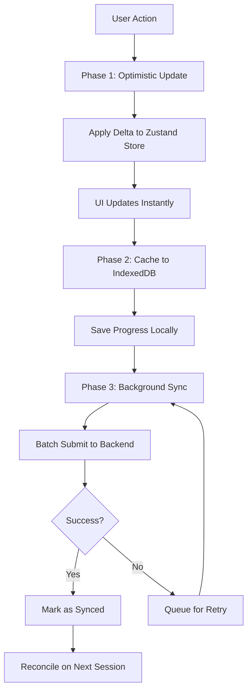
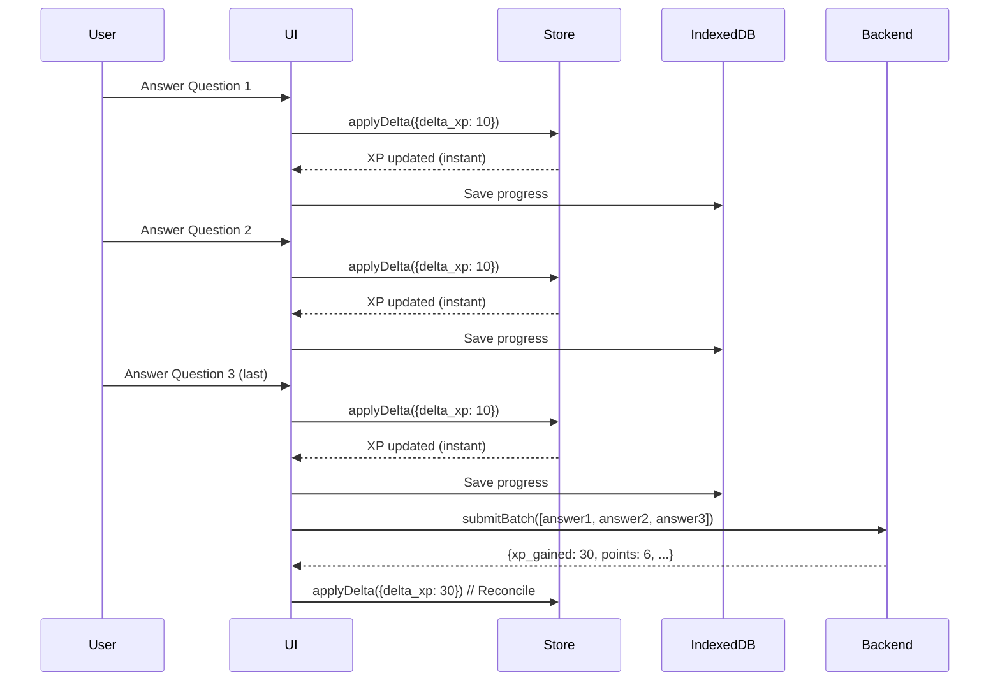

# Last War Delta Strategy - Complete Documentation

> **Last Updated:** December 2024  
> **Status:** Authoritative Reference  
> **Pattern:** "Last War" Mobile Game Performance

## Overview

The Delta Strategy is a **three-phase optimistic update pattern** that ensures instant UI feedback while maintaining data consistency with the backend. It's inspired by mobile game architecture where user actions must feel immediate, even when network latency exists.

### Core Principle

> **Update UI instantly with math, sync to backend in background, reconcile on next session.**

---

## The Three-Phase Flow



### Phase 1: Optimistic Update (Instant)

**Goal:** User sees feedback immediately (< 50ms)

```typescript
// User answers MCQ correctly
const delta = {
  delta_xp: 10,
  delta_points: 2,
  delta_sparks: 5
}

// Apply immediately to Zustand store
useAppStore.getState().applyDelta(delta)

// UI updates instantly - user sees:
// ✅ XP: 100 → 110
// ✅ Points: $50 → $52
// ✅ Sparks: 25 → 30
```

**Key Points:**
- No API call needed for UI update
- Pure math operation (add/subtract)
- Happens synchronously in the same frame

### Phase 2: Cache to IndexedDB (Fast)

**Goal:** Persist locally for offline support (~10-50ms)

```typescript
// Save progress to IndexedDB immediately
await localStore.setProgress(senseId, {
  status: 'hollow',
  updatedAt: Date.now()
})

// Also queue action for background sync
await syncService.queueAction('COMPLETE_VERIFICATION', senseId, {
  isCorrect: true,
  responseTime: 1200
})
```

**Key Points:**
- IndexedDB write is async but fast
- User can close app immediately - data is safe
- Works offline (no network required)

### Phase 3: Background Sync (Silent)

**Goal:** Sync to backend without blocking UI (fire-and-forget)

```typescript
// Background sync happens automatically
// - Every 5 seconds if pending actions exist
// - Immediately after coming online
// - On app focus/blur events

// Batch all pending actions
const pending = await localStore.getPendingActions()
// [{ type: 'COMPLETE_VERIFICATION', senseId: 'apple.01', ... }, ...]

// Submit to backend
await fetch('/api/v1/mcq/submit-batch', {
  method: 'POST',
  body: JSON.stringify({ answers: pending })
})

// Mark as synced
await localStore.markSynced(syncedIds)
```

**Key Points:**
- Happens in background (user doesn't wait)
- Batches multiple actions (efficient)
- Retries on failure (eventual consistency)
- Reconciles on next session (handles drift)

---

## applyDelta Function

**Location:** `stores/useAppStore.ts`

### Interface

```typescript
interface ActionDelta {
  // XP changes
  delta_xp?: number           // e.g., +10 for correct answer
  delta_level?: number         // e.g., +1 for level up
  
  // Currency changes (Three-Currency System)
  delta_sparks?: number       // e.g., +5 for fast answer
  delta_essence?: number      // e.g., +1 for perfect score
  delta_energy?: number       // e.g., -1 for mining action
  delta_blocks?: number       // e.g., +1 for completing word
  
  // Points (wallet balance)
  delta_points?: number       // e.g., +$2 for correct MCQ
  
  // Progress changes
  delta_discovered?: number   // e.g., +1 for new word
  delta_solid?: number        // e.g., +1 for mastered word
  delta_hollow?: number       // e.g., +1 for in-progress word
  
  // Streak
  streak_extended?: boolean
  new_streak_days?: number
  
  // Special events (trigger UI effects)
  achievements_unlocked?: string[]  // Achievement IDs to show toast
  level_up_to?: number              // New level (triggers celebration)
}
```

### Implementation

```typescript
applyDelta: (delta) => {
  set((state) => {
    const updates: Partial<AppState> = {}
    
    // Update learner profile (XP, level, currencies)
    if (state.learnerProfile && (
      delta.delta_xp || delta.delta_sparks || delta.delta_essence || 
      delta.delta_energy || delta.delta_blocks || delta.level_up_to
    )) {
      const profile = { ...state.learnerProfile }
      
      // XP: Simple addition
      if (delta.delta_xp) {
        profile.level = {
          ...profile.level,
          total_xp: (profile.level.total_xp || 0) + delta.delta_xp,
        }
      }
      
      // Currencies: Simple addition
      if (profile.currencies) {
        if (delta.delta_sparks) {
          profile.currencies.sparks = (profile.currencies.sparks || 0) + delta.delta_sparks
        }
        // ... same for essence, energy, blocks
      }
      
      updates.learnerProfile = profile
    }
    
    // Update wallet balance
    if (delta.delta_points) {
      updates.balance = {
        ...state.balance,
        available_points: state.balance.available_points + delta.delta_points,
        total_earned: state.balance.total_earned + delta.delta_points,
      }
    }
    
    // Update progress stats
    if (delta.delta_discovered || delta.delta_solid || delta.delta_hollow) {
      updates.progress = {
        ...state.progress,
        total_discovered: state.progress.total_discovered + (delta.delta_discovered || 0),
        solid_count: state.progress.solid_count + (delta.delta_solid || 0),
        hollow_count: state.progress.hollow_count + (delta.delta_hollow || 0),
      }
    }
    
    return updates
  }, false, 'applyDelta')
}
```

### Usage Example

```typescript
// In MCQSession component
const handleAnswer = async (isCorrect: boolean) => {
  // Phase 1: Optimistic update
  useAppStore.getState().applyDelta({
    delta_xp: isCorrect ? 10 : 2,
    delta_points: isCorrect ? 2 : 0,
    delta_sparks: isCorrect ? 5 : 0,
  })
  
  // Phase 2: Cache to IndexedDB
  await localStore.setProgress(senseId, {
    status: isCorrect ? 'hollow' : 'raw',
    updatedAt: Date.now()
  })
  
  // Phase 3: Queue for background sync
  await syncService.queueAction('COMPLETE_VERIFICATION', senseId, {
    isCorrect,
    responseTime: Date.now() - startTime
  })
}
```

---

## Batch Submission Pattern

For MCQ sessions, answers are collected and submitted in batches for efficiency.

### Flow



### Implementation

**File:** `components/features/mcq/MCQSession.tsx`

```typescript
// Collect answers as user progresses
const [pendingAnswers, setPendingAnswers] = useState<Answer[]>([])

const handleAnswer = (isCorrect: boolean) => {
  // Phase 1: Optimistic update (instant feedback)
  useAppStore.getState().applyDelta({
    delta_xp: isCorrect ? 10 : 2,
    delta_points: isCorrect ? 2 : 0,
  })
  
  // Store answer for batch submission
  setPendingAnswers(prev => [...prev, {
    mcqId: currentMCQ.id,
    selectedIndex: selectedOption,
    isCorrect,
    senseId: currentMCQ.sense_id,
    // ... other fields
  }])
}

// On session complete, submit batch
const handleComplete = async () => {
  // Submit all answers at once
  const batchResults = await mcqApi.submitBatchAnswers(pendingAnswers)
  
  // Reconcile with server response
  const finalXp = batchResults.reduce((sum, r) => 
    sum + (r.gamification?.xp_gained || 0), 0
  )
  
  // Apply final deltas (may differ from optimistic)
  useAppStore.getState().applyDelta({
    delta_xp: finalXp,  // Server truth
    delta_points: finalPoints,
    delta_sparks: sparksGained,
  })
}
```

**Why Batch?**
- Reduces API calls (1 request vs N requests)
- Faster overall (parallel processing on backend)
- Atomic operation (all or nothing)
- Better error handling (retry entire batch)

---

## Background Sync Service

**File:** `services/syncService.ts`

### How It Works

```typescript
// 1. Actions are queued to IndexedDB
await syncService.queueAction('COMPLETE_VERIFICATION', senseId, {
  isCorrect: true,
  responseTime: 1200
})

// 2. Sync service automatically syncs every 5 seconds
// (or immediately after coming online)

// 3. Batch all pending actions
const pending = await localStore.getPendingActions()
// [{ type: 'COMPLETE_VERIFICATION', senseId: 'apple.01', ... }, ...]

// 4. Submit to backend
const response = await authenticatedPost('/api/v1/sync', {
  actions: pending
})

// 5. Mark as synced
await localStore.markSynced(syncedIds)
```

### Sync Triggers

1. **Timer-based:** Every 5 seconds if pending actions exist
2. **Online event:** Immediately after coming online
3. **App focus:** When user returns to app
4. **Manual:** `syncService.forceSync()` for critical operations

### Retry Logic

- **Success:** Mark as synced, schedule next sync if more pending
- **Failure:** Retry after 30 seconds, keep in queue
- **Offline:** Pause syncing, resume when online

---

## IndexedDB Caching Integration

**File:** `lib/local-store.ts`

### Progress Storage

```typescript
// Save progress immediately (Phase 2)
await localStore.setProgress(senseId, {
  status: 'hollow',
  tier: 3,
  masteryLevel: 'learning',
  updatedAt: Date.now()
})

// Load progress instantly (Bootstrap)
const progress = await localStore.getAllProgress()
// Returns all progress from IndexedDB (~10ms)
```

### Action Queue

```typescript
// Queue action for background sync
await localStore.queueAction({
  type: 'COMPLETE_VERIFICATION',
  senseId: 'apple.01',
  payload: { isCorrect: true, responseTime: 1200 }
})

// Get pending actions for sync
const pending = await localStore.getPendingActions()
// Returns all unsynced actions
```

### Cache Strategy

```
┌─────────────────────────────────────────┐
│         IndexedDB Stores                 │
├─────────────────────────────────────────┤
│  progress: LocalBlockProgress[]        │
│  - senseId → status, tier, mastery      │
│  - Loaded instantly on Bootstrap        │
│                                         │
│  syncQueue: UserAction[]                │
│  - Queued actions for background sync   │
│  - Cleared after successful sync        │
│                                         │
│  cache: { key, data, expiresAt }        │
│  - General-purpose cache                │
│  - TTL-based expiration                 │
└─────────────────────────────────────────┘
```

---

## Reconciliation Pattern

When app reopens, reconcile local state with server truth.

### Bootstrap Reconciliation

**File:** `services/bootstrap.ts`

```typescript
// 1. Load from IndexedDB (instant)
const localProgress = await localStore.getAllProgress()

// 2. Fetch from backend (with timeout)
try {
  const backendProgress = await Promise.race([
    progressApi.getUserProgress(),
    new Promise((_, reject) => 
      setTimeout(() => reject(new Error('timeout')), 5000)
    )
  ])
  
  // 3. Reconcile: Backend truth overrides local
  backendProgress.forEach(p => {
    // Update local cache with server data
    localStore.setProgress(p.sense_id, {
      status: p.status,
      // ... other fields from server
    })
  })
} catch (error) {
  // Use IndexedDB data (offline or timeout)
  console.warn('Using cached progress:', localProgress.length)
}
```

### Delta Reconciliation

When batch submission returns, reconcile optimistic updates:

```typescript
// Optimistic: User saw +10 XP
applyDelta({ delta_xp: 10 })

// Server response: Actually +12 XP (bonus for speed)
applyDelta({ delta_xp: 12 })  // Overwrites, user sees +2 more

// Or: Server says +8 XP (different calculation)
applyDelta({ delta_xp: 8 })   // User sees -2, but server is truth
```

**Key Point:** Server response is always the source of truth. Optimistic updates are "best guess" for instant feedback.

---

## Rules and Patterns

### ✅ DO

1. **Always apply delta immediately** - User must see instant feedback
2. **Save to IndexedDB** - Persist for offline support
3. **Queue for background sync** - Don't block UI
4. **Batch when possible** - Reduce API calls
5. **Reconcile on next session** - Handle drift

### ❌ DON'T

1. **Wait for API response** - Never block UI for network
2. **Skip IndexedDB** - Always cache locally
3. **Sync synchronously** - Always background
4. **Ignore failures** - Retry and reconcile
5. **Double-count deltas** - Server response overwrites optimistic

### Anti-Patterns

```typescript
// ❌ WRONG: Wait for API before updating UI
const response = await submitAnswer(answer)
useAppStore.getState().applyDelta({ delta_xp: response.xp })
// User waits 500ms+ for network

// ✅ CORRECT: Update immediately, sync later
useAppStore.getState().applyDelta({ delta_xp: 10 })  // Instant
await syncService.queueAction('COMPLETE_VERIFICATION', senseId)
// User sees feedback in < 50ms
```

```typescript
// ❌ WRONG: Only save to backend
await fetch('/api/v1/progress', { method: 'POST', body: data })
// Lost if offline, slow, no instant feedback

// ✅ CORRECT: Save locally, sync in background
await localStore.setProgress(senseId, progress)  // Instant
await syncService.queueAction('UPDATE_PROGRESS', senseId)
// Works offline, instant feedback
```

---

## Examples by Use Case

### Example 1: MCQ Answer

```typescript
// User answers correctly
const handleAnswer = async (isCorrect: boolean) => {
  // Phase 1: Optimistic update
  useAppStore.getState().applyDelta({
    delta_xp: isCorrect ? 10 : 2,
    delta_points: isCorrect ? 2 : 0,
    delta_sparks: isCorrect ? 5 : 0,
  })
  
  // Phase 2: Cache progress
  await localStore.setProgress(senseId, {
    status: isCorrect ? 'hollow' : 'raw',
    updatedAt: Date.now()
  })
  
  // Phase 3: Queue for sync
  await syncService.queueAction('COMPLETE_VERIFICATION', senseId, {
    isCorrect,
    responseTime: Date.now() - startTime
  })
}
```

### Example 2: Mining Words

```typescript
// User mines a word
const handleMine = async (senseId: string) => {
  // Phase 1: Optimistic update
  useAppStore.getState().applyDelta({
    delta_xp: 10,
    delta_points: 10,
    delta_discovered: 1,
  })
  
  // Phase 2: Cache locally
  await localStore.setProgress(senseId, {
    status: 'raw',
    updatedAt: Date.now()
  })
  
  // Phase 3: Background sync
  gameService.mineBatch([senseId], 1)
    .then((result) => {
      // Reconcile with server response
      useAppStore.getState().applyDelta({
        delta_xp: result.delta_xp,
        delta_points: result.delta_points,
      })
    })
    .catch((err) => {
      // Don't fail loudly - word is still mined locally
      console.warn('Mining sync failed:', err)
    })
}
```

### Example 3: Batch MCQ Session

```typescript
// User completes 5-question session
const handleSessionComplete = async () => {
  // Phase 1: Already applied per-question (optimistic)
  // Total: +50 XP, +10 points (optimistic)
  
  // Phase 2: Progress already cached per-question
  
  // Phase 3: Batch submit all answers
  const batchResults = await mcqApi.submitBatchAnswers(pendingAnswers)
  
  // Reconcile with server truth
  const finalXp = batchResults.reduce((sum, r) => 
    sum + (r.gamification?.xp_gained || 0), 0
  )
  const finalPoints = batchResults.reduce((sum, r) => 
    sum + (r.gamification?.points_earned || 0), 0
  )
  
  // Apply final deltas (may differ from optimistic)
  useAppStore.getState().applyDelta({
    delta_xp: finalXp,      // Server truth
    delta_points: finalPoints,
    delta_sparks: sparksGained,
    delta_essence: essenceGained,
  })
}
```

---

## Performance Characteristics

| Phase | Latency | Blocking | User Experience |
|-------|---------|----------|-----------------|
| Optimistic Update | < 1ms | No | Instant feedback |
| IndexedDB Write | 10-50ms | No | Feels instant |
| Background Sync | 100-2000ms | No | Happens silently |
| Reconciliation | On next session | No | Seamless |

**Total User-Perceived Latency:** < 50ms (optimistic update only)

---

## Error Handling

### Network Failure

```typescript
// User action succeeds locally
applyDelta({ delta_xp: 10 })
await localStore.setProgress(senseId, { status: 'hollow' })

// Network fails
await syncService.queueAction('COMPLETE_VERIFICATION', senseId)
// → Queued in IndexedDB

// Next session: Retry sync
// → Eventually consistent
```

### Server Rejection

```typescript
// Optimistic: +10 XP
applyDelta({ delta_xp: 10 })

// Server rejects (validation error)
// → Keep optimistic update (user already saw it)
// → Log error for debugging
// → Reconcile on next session
```

### Data Drift

```typescript
// Local: 100 XP
// Server: 105 XP (another device updated)

// On reconciliation:
// → Server truth wins (105 XP)
// → User sees +5 XP (bonus!)
```

---

## Testing Strategy

### Unit Tests

- `applyDelta` math correctness
- IndexedDB persistence
- Action queueing

### Integration Tests

- End-to-end flow (action → delta → cache → sync)
- Offline behavior
- Reconciliation logic

### Performance Tests

- Optimistic update latency (< 50ms)
- IndexedDB write latency (< 100ms)
- Batch sync efficiency

---

## Related Documentation

- `CACHING_RULES.md` - IndexedDB usage patterns
- `ARCHITECTURE_PRINCIPLES.md` - Overall system design
- `.cursorrules` - Bootstrap frontloading strategy
- `EMOJI_MVP_PLAN.md` - Emoji pack implementation

---

## Summary

The Delta Strategy ensures:

1. **Instant Feedback** - User sees changes immediately (< 50ms)
2. **Offline Support** - Works without network (IndexedDB cache)
3. **Data Consistency** - Server is source of truth (reconciliation)
4. **Performance** - No blocking network calls
5. **Reliability** - Retry logic and error handling

**Key Takeaway:** Update UI with math, sync to backend in background, reconcile on next session.

